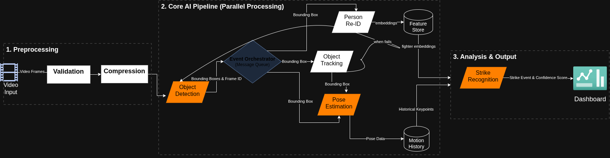

# fight-judge

An AI system for scoring boxing and MMA fights according to official judging criteria.
The project builds a full computer-vision pipeline — from raw fight footage to pose-based
action recognition — with the eventual goal of automated, rule-compliant fight scoring.



---

## Table of Contents

- [Project Overview](#project-overview)
- [Pipeline Architecture](#pipeline-architecture)
- [Results & Metrics](#results--metrics)
- [Dataset](#dataset)
- [Repository Structure](#repository-structure)
- [Tech Stack](#tech-stack)
- [Roadmap](#roadmap)

---

## Project Overview

Combat sports judging is notoriously subjective and inconsistent. This project explores
whether a pose-estimation-based AI can objectively quantify fighter output — effective
striking, aggression, ring generalship — to assist or replace human judges.

The current phase focuses on building a high-quality, labeled dataset of fighter poses
across diverse UFC matchups, and training a robust keypoint detection model as the
foundation for downstream action recognition.

---

## Pipeline Architecture

```
Stage 1 — Frame Extraction
  scripts/data_preparation/extract-frames.py
  └─ MP4 fight footage → JPEG frames (all frames, no sampling)

Stage 2 — Fighter Detection Annotation
  [Manual annotation via Roboflow]
  └─ 5,106 frames labeled with fighter bounding boxes (1 class: "fighter")
  └─ Dataset: mma-fighter-detection-dataset/ (YOLO format)

Stage 3 — Pose Dataset Auto-Generation  ← KEY CONTRIBUTION
  scripts/data_preparation/yolo-to-coco-bbox.py
  └─ Converts YOLO bbox labels → COCO JSON (required by mmpose)
  scripts/pose_estimation/create-pose-dataset-from-object-detection.ipynb
  └─ Runs YOLOv11x-pose on each frame, matches detections to annotated
     fighter bboxes via IoU (threshold 0.6), extracts 17 COCO keypoints
  └─ Output: pose-detection-yolov11x-dataset/ (YOLO-Pose format)

Stage 4 — Annotation Fixing
  scripts/data_preparation/fix_annotations.py
  └─ Normalizes COCO JSON output from ViTPose inference pipeline

Stage 5 — Pose Model Training
  [YOLO11x-pose finetuned on pose-detection-yolov11x-dataset]
  [ViTPose run via scripts/pose_estimation/run-inference-batch.py]

Stage 6 — Visualization & Validation
  scripts/pose_estimation/visualize_pose.py
  └─ Renders YOLO-Pose labels as annotated images for quality checks

Stage 7 — Action Recognition  [PLANNED]
  └─ GCN / Transformer on multi-frame keypoint sequences
  └─ Strike classification, landing detection, scoring

Stage 8 — Scoring System  [PLANNED]
  └─ Rule-based + learned scoring engine (10-point must system)
```

---

## Results & Metrics

### Fighter Detection (YOLOv8s, finetuned)

| Metric     | Value  |
|------------|--------|
| mAP50-95   | **0.983** |
| Dataset    | 5,106 images, 20 UFC fights |
| Classes    | 1 (fighter) |

### Pose Dataset Auto-Generation

| Metric                        | Value      |
|-------------------------------|------------|
| Total images processed        | 5,106      |
| Total fighter instances       | 10,186     |
| Fighters matched with poses   | **10,155 (99.7%)** |
| Fighters without pose match   | 31 (0.3%) |
| Matching method               | IoU ≥ 0.6  |
| Pose model used for labeling  | YOLOv11x-pose (pretrained) |

### Pose Estimation (YOLO11x-pose, finetuned)

| Metric   | Value    |
|----------|----------|
| Pose mAP | ~88%     |
| Keypoints | 17 (COCO) |
| Format   | YOLO-Pose |

---

## Dataset

**MMA Fighter Detection Dataset**
- **5,106 images** extracted from 20 UFC fights (stand-up combat phases)
- **Resolution:** 640×640 px
- **Format:** YOLO bounding box (1 class: `fighter`)
- **License:** CC BY-NC-SA 4.0
- **Published on Mendeley Data:**
  [https://data.mendeley.com/datasets/c456bnk8bm/1](https://data.mendeley.com/datasets/c456bnk8bm/1)

**Citation:**
```
Faisal, Hasan (2025). MMA Fighter Detection Dataset.
Mendeley Data, V1. doi: 10.17632/c456bnk8bm.1
```

Fights included span multiple weight classes and feature athletes such as
Poirier, Adesanya, Pereira, Topuria, Gaethje, and others. Images were
exported from Roboflow without augmentation to preserve label quality.

---

## Repository Structure

```
fight-judge/
├── scripts/
│   ├── data_preparation/
│   │   ├── extract-frames.py                    # Stage 1: video → frames
│   │   ├── yolo-to-coco-bbox.py                 # Stage 3a: YOLO → COCO JSON
│   │   └── fix_annotations.py                   # Stage 4: fix COCO annotations
│   └── pose_estimation/
│       ├── create-pose-dataset-from-object-detection.ipynb  # Stage 3b: pose labeling
│       ├── run-inference-batch.py               # Stage 5: ViTPose batch inference
│       └── visualize_pose.py                    # Stage 6: annotation visualization
├── annotations/                                 # COCO JSON annotations
├── mma-fighter-detection-dataset/               # YOLO detection dataset (metadata)
├── pose-detection-yolov11x-dataset/             # YOLO-Pose dataset (labels committed)
├── notes/                                       # Technical notes
│   ├── PoseEstimation.md
│   └── ActionRecognition.md
├── system-design-dark.png                       # Architecture diagram (dark)
├── system-design-light.png                      # Architecture diagram (light)
├── METHODOLOGY.md                               # Technical write-up
└── pyproject.toml
```

---

## Tech Stack

| Component            | Technology                          |
|----------------------|-------------------------------------|
| Object detection     | YOLOv8s (Ultralytics), finetuned    |
| Pose labeling        | YOLOv11x-pose (pretrained, Ultralytics) |
| Pose estimation      | YOLO11x-pose (finetuned), ViTPose (mmpose) |
| Dataset management   | Roboflow                            |
| Annotation format    | YOLO (.txt), COCO JSON              |
| Training platform    | Kaggle (Tesla P100-PCIE-16GB)       |
| Language             | Python 3.12                         |
| Core libraries       | OpenCV, NumPy, Ultralytics, mmpose, tqdm |

---

## Roadmap

| Stage | Task | Status |
|-------|------|--------|
| 1 | Frame extraction | Done |
| 2 | Fighter detection annotation (Roboflow) | Done |
| 2 | Fighter detection model training (YOLOv8s) | Done — mAP50-95: 0.983 |
| 3 | Pose dataset auto-generation | Done — 99.7% match rate |
| 5 | Pose model finetuning (YOLO11x-pose) | Done — ~88% mAP |
| 5 | ViTPose inference pipeline | Done |
| 7 | Action recognition (GCN / Transformer) | Planned |
| 7 | Strike classification (jab, cross, hook, kick, ...) | Planned |
| 7 | Landing detection (clean strike vs. blocked/missed) | Planned |
| 8 | Scoring engine (10-point must system) | Planned |
| — | Re-ID for fighter identity tracking | Planned |
| — | Ground game: takedowns, submissions, control time | Planned |

---

## License

Code: [MIT License](LICENSE)
Dataset: [CC BY-NC-SA 4.0](https://creativecommons.org/licenses/by-nc-sa/4.0/)
